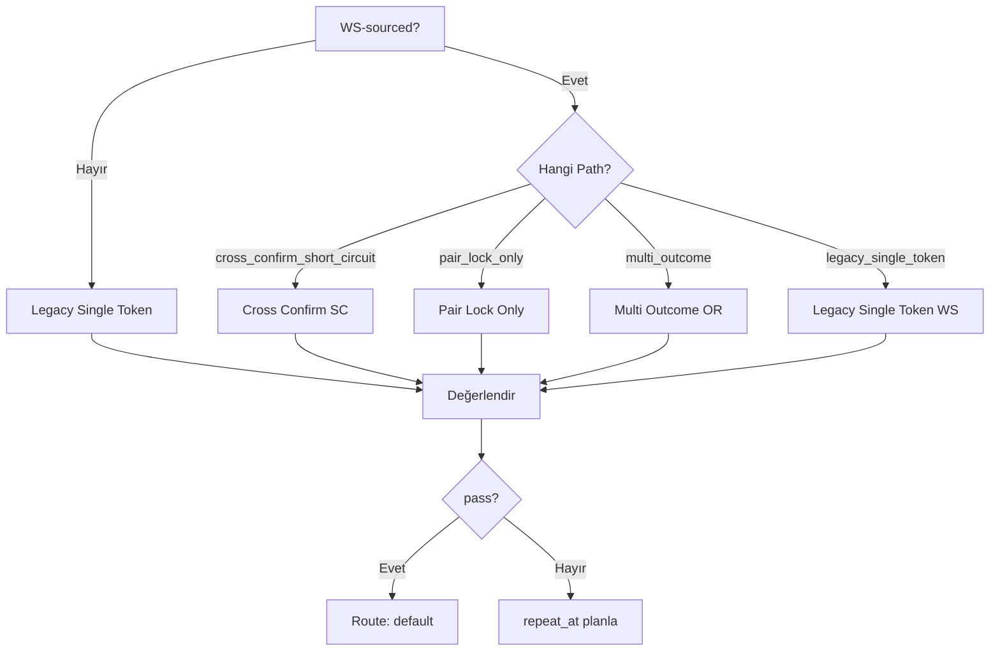
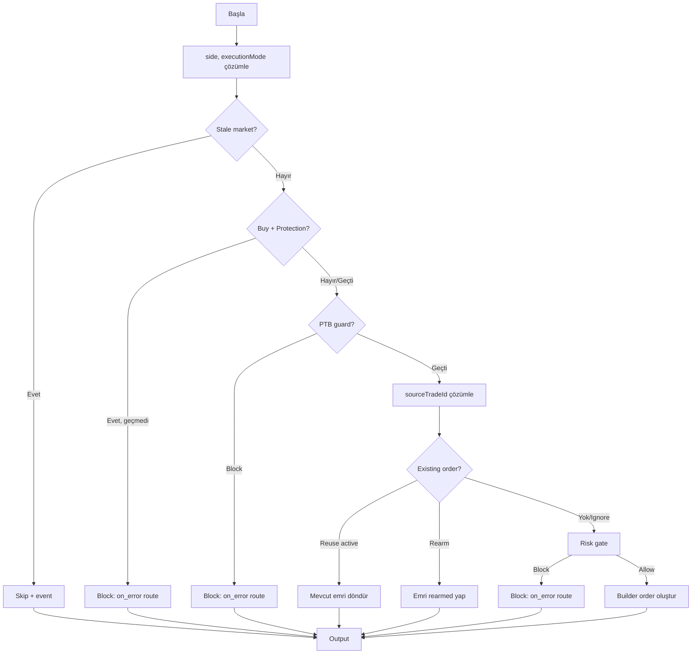

# Trade Flow Node Özellikleri

## İçindekiler

1. [trigger.market_price](#1-triggermarket_price)
2. [action.place_order (Aksiyon Emir Gönder)](#2-actionplace_order---aksiyon-emir-gönder)
3. [Ek: Yeni Özellikler](#3-ek-yeni-özellikler)

---

## 1. trigger.market_price

### Amaç

Piyasa fiyatını izleyerek tanımlı koşullar sağlandığında downstream (akış sonrası) node'lara sinyal gönderen tetikleyici node. Hem polling tabanlı hem de WebSocket (gerçek zamanlı) fiyat akışlarıyla çalışır.

### Genel Çalışma Mantığı

`trigger.market_price` node'u bir **gözlemci (watchdog)** gibi çalışır. Sürekli olarak bir Polymarket market'inin fiyatını kontrol eder ve tanımladığınız koşul gerçekleştiğinde (`pass = true` olur) akıştaki bir sonraki node'a (genellikle `action.place_order`) geçiş izni verir.

Çalışma döngüsü şu şekildedir:

```
[Bot Başlatılır]
    │
    ▼
[trigger.market_price node'u çalışır]
    │
    ├── Market slug çözümlenir (auto_scope veya manuel)
    │
    ├── Fiyat kaynağı seçilir:
    │   ├── WS-sourced: WebSocket'ten gelen gerçek zamanlı fiyat
    │   └── Polling: WS yoksa REST API veya CLOB snapshot'tan fiyat çeker
    │
    ├── Önceki fiyat ile karşılaştırılır
    │
    ├── Koşul değerlendirilir (cross_above, cross_below, level_above, level_below)
    │
    ├── PTB gate (price-to-beat) kontrolü (varsa)
    │
    ├── Underlying protection kontrolü (varsa)
    │
    ├── Once modu idempotency kontrolü (once modundaysa)
    │
    ▼
[pass = true?] ── Evet ──► [Sonraki node'a route: "default"]
       │
       Hayır
       │
       ▼
[repeat_at planlanır] (repeat modundaysa, interval_ms sonra tekrar dene)

### Config Parametreleri

#### Örneklerle Parametreler

**Örnek 1: Basit Fiyat Eşiği (Polling)**
BTC 5m Up market'inin %55'in üzerine çıktığında tetiklensin:
```json
{
  "key": "trigger_1",
  "nodeType": "trigger.market_price",
  "config": {
    "marketSlug": "btc-updown-5m",
    "tokenId": "71321045679252212594626385532706912750332728571942532289631379312455583992563",
    "outcomeLabel": "Up",
    "triggerCondition": "cross_above",
    "triggerPrice": 0.55,
    "repeatMode": "repeat",
    "minIntervalMs": 5000
  }
}
```
**Ne olur?** Bot her 5 saniyede bir fiyatı kontrol eder. Fiyat %54'ten %56'ya geçtiğinde `pass = true` olur ve sonraki node'a geçilir.

**Örnek 2: Tek Seferlik Tetikleme (Once Modu)**
BTC 15m Down market'i %40'ın altına düştüğünde bir kere tetiklensin:
```json
{
  "key": "trigger_once_1",
  "nodeType": "trigger.market_price",
  "config": {
    "marketSlug": "btc-updown-15m",
    "tokenId": "...",
    "outcomeLabel": "Down",
    "triggerCondition": "level_below",
    "triggerPrice": 0.40,
    "repeatMode": "once"
  }
}
```
**Ne olur?** `level_below` koşulu `once` modunu gerektirir. Fiyat %40'ın altına düştüğünde tetiklenir, idempotency key ile kaydedilir ve bu run'da bir daha tetiklenmez.

**Örnek 3: Çoklu Sonuç Koşulları (Multi-Outcome)**
Aynı market'te hem Up hem Down izle, hangisi önce koşulu sağlarsa o tetiklensin:
```json
{
  "key": "trigger_multi",
  "nodeType": "trigger.market_price",
  "config": {
    "marketSlug": "btc-updown-5m",
    "outcomeConditions": [
      {
        "outcomeLabel": "Up",
        "triggerCondition": "cross_above",
        "triggerPrice": 0.60
      },
      {
        "outcomeLabel": "Down",
        "triggerCondition": "cross_below",
        "triggerPrice": 0.35
      }
    ]
  }
}
```
**Ne olur?** OR mantığıyla çalışır. Up %60'ın üzerine çıksa DA Down %35'in altına düşse DE tetiklenir. Hangisi önce sağlanırsa o `triggered_outcome_label` olarak kaydedilir.

**Örnek 4: Pair Lock Only (Sadece Token Bağlama)**
Fiyat koşulu yok, sadece YES/NO token ID'lerini context'e bağla:
```json
{
  "key": "trigger_pairlock",
  "nodeType": "trigger.market_price",
  "config": {
    "marketSlug": "btc-updown-5m",
    "bindingMode": "pair_lock_only"
  }
}
```
**Ne olur?** Fiyat kontrolü yapılmaz. Market'ten YES ve NO token ID'leri çözümlenip flow context'e yazılır. Bu, downstream node'un hangi token'larda işlem yapacağını bilmesi için kullanılır.

**Örnek 5: Auto Scope + Price-to-Beat Trigger**
Otomatik market seçimi ile price-to-beat gate:
```json
{
  "key": "trigger_auto_ptb",
  "nodeType": "trigger.market_price",
  "config": {
    "triggerCondition": "cross_above",
    "triggerPrice": 0.52,
    "priceToBeatTriggerEnabled": true,
    "priceToBeatMode": "manual",
    "priceToBeatTriggerMinGap": 0.02,
    "priceToBeatTriggerUnit": "usd"
  }
}
```
**Ne olur?** `auto_scope` modunda Gamma API'den aktif BTC 5m market otomatik seçilir. Fiyat %52'nin üzerine çıktığında (standart koşul) + price-to-beat gap en az $0.02 ise (PTB gate) tetiklenir. İki guard'ın da geçmesi gerekir (`StandardAndPtb` gate modu).

#### Parametre Tablosu

| Parametre | Tip | Varsayılan | Açıklama |
|---|---|---|---|
| `varKey` | string | node.key | Fiyat değeri flow context'e yazılırken kullanılan değişken anahtarı |
| `minIntervalMs` | int | 10000 | Polling modunda iki kontrol arası minimum süre (ms). Alt sınır: 250ms |
| `pollIntervalMs` | int | 10000 | `minIntervalMs` için alias |
| `priceMode` | string | `"composite"` | Fiyat alma modu. `WsPriceMode::parse` ile çözülür. Seçenekler: `composite`, `midpoint`, `best_bid`, `best_ask`, `last_trade` |
| `repeatMode` | string | `"repeat"` | `"once"` veya `"repeat"`. `once` modunda tetiklendiğinde bir daha çalışmaz |
| `marketSlug` | string | - | İzlenecek market (ör. `btc-updown-5m`). `auto_scope` modunda opsiyonel |
| `tokenId` | string | - | İzlenecek CTF token ID. `outcomeConditions` kullanılmıyorsa zorunlu |
| `outcomeLabel` | string | - | Sonuç etiketi (ör. `"Up"`, `"Down"`) |
| `triggerCondition` | string | - | Tetikleme koşulu. Desteklenen değerler: `cross_above`, `cross_below`, `level_above`, `level_below` |
| `triggerPrice` | float | - | Tetikleme fiyat eşiği (0.0–1.0 arası olasılık) |
| `triggerPriceCent` | float | - | Tetikleme fiyat eşiği (sent cinsinden, /100 ile normalize edilir) |
| `maxPrice` | float | - | Maksimum fiyat sınırı (0.0–1.0 arası) |
| `maxPriceCent` | float | - | Maksimum fiyat sınırı (sent cinsinden) |
| `outcomeConditions` | array | - | Çoklu sonuç koşulları dizisi. Her eleman: `{tokenId, outcomeLabel, triggerCondition, triggerPrice/triggerPriceCent, maxPrice/maxPriceCent}`. OR mantığıyla değerlendirilir |
| `bindingMode` | string | `"standard"` | `"standard"` veya `"pair_lock_only"`. `pair_lock_only` modunda sadece YES/NO token ID'leri bağlanır, fiyat koşulu değerlendirmesi atlanır |
| `protectionMode` | string | - | Underlying koruma modu. `underlying_confirm` gibi değerler alır |
| `cycleWindowMode` | string | - | Döngü pencere modu: `"first"`, `"last"`, `"custom_range"` |
| `cycleWindowSecs` | int | - | Döngü pencere süresi (saniye) |
| `cycleWindowStartSec` | int | - | Özel aralık başlangıç süresi (saniye) |
| `cycleWindowEndSec` | int | - | Özel aralık bitiş süresi (saniye) |

### Price-to-Beat Trigger Config (alt parametreler)

| Parametre | Tip | Açıklama |
|---|---|---|
| `priceToBeatTriggerEnabled` | bool | PTB trigger gate aktif mi |
| `priceToBeatMode` | string | `"manual"` veya otomatik mod |
| `priceToBeatTriggerMinGap` | float | Minimum boşluk (gap) |
| `priceToBeatTriggerMaxGap` | float | Maksimum boşluk (opsiyonel) |
| `priceToBeatTriggerUnit` | string | `"usd"` (varsayılan) veya `"pct"` |

### Market Modları

#### auto_scope Modu
- `node_market_mode(node) == "auto_scope"` ile aktif
- Market slug Gamma API'den otomatik çözümlenir (`sync_trigger_market_auto_scope_context`)
- Süresi dolmuş marketler otomatik atlanır (30 dakika expiration)
- WS-sourced adımlarda market slug step'ten alınır, Gamma API tekrar çağrılmaz
- `outcomeLabel` ile token ID çözümlemesi yapılabilir

#### Manuel Mod
- `marketSlug` config'den veya flow context'ten alınır
- Boş market slug hataya sebep olur

### Çalışma Yolları (Execution Paths)



#### 1. cross_confirm_short_circuit
- WS ön doğrulama katmanında cross-confirmation yapılmışsa aktif
- `wsEvaluationMode` üzerinden tespit edilir
- Standart koşul değerlendirmesini atlar, doğrudan `pass = true`

#### 2. pair_lock_only
- `bindingMode == "pair_lock_only"` ve `outcomeConditions` boşsa aktif
- Sadece YES/NO token ID'lerini flow context'e bağlar
- Fiyat koşul değerlendirmesi yapılmaz

#### 3. multi_outcome
- `outcomeConditions` dizisi tanımlıysa aktif
- Her koşul OR mantığıyla değerlendirilir
- İlk eşleşen koşul tetiklenir

#### 4. legacy_single_token
- Tek token ID ile çalışır
- `tokenId` config'den veya context'ten çözümlenir

### Gate Modları

| Gate Modu | Koşul | Açıklama |
|---|---|---|
| `StandardOnly` | triggerCondition var, PTB yok | Sadece standart fiyat koşulu |
| `StandardAndPtb` | triggerCondition + PTB var | Önce standart koşul, sonra PTB gate |
| `PtbOnly` | triggerCondition yok, PTB var | Sadece price-to-beat gate |

### Koşul Değerlendirme Detayları (Nasıl Çalışır)

`evaluate_trigger_market_price_condition` fonksiyonu 4 temel koşul tipini işler. Her biri farklı şekilde fiyat karşılaştırması yapar:

#### cross_above (Yukarı Kesişim)

**Mantık:** Önceki fiyat eşik altındaysa ve mevcut fiyat eşik üstündeyse tetiklenir. Fiyatın yukarı yönde eşik değerini geçmesi gerekir.

```
Örnek Senaryo: triggerPrice = 0.55

Zaman    Fiyat    Önceki    Sonuç
------   -----    ------    ------
T1       0.52     yok       pass=false ("no_previous")  ← İlk tick, önceki fiyat yok
T2       0.54     0.52      pass=false ("no_cross")     ← 0.55'in altında
T3       0.56     0.54      pass=true  ("cross_detected") ← 0.54'ten 0.56'ya geçti, 0.55'i yukarı kesti!
T4       0.58     0.56      pass=false ("no_cross")     ← Zaten üstünde, yeni cross yok
T5       0.53     0.58      pass=false ("no_cross")     ← Düşüyor, cross_above değil
```

**maxPrice ile kullanım:**
```
triggerPrice = 0.50, maxPrice = 0.65

T1: fiyat=0.48 → 0.52  → pass=true  ("cross_detected")    ← 0.50'yi yukarı kesti, 0.65'in altında
T2: fiyat=0.64 → 0.66  → pass=false ("above_max_price")   ← 0.65'i aştı
T3: fiyat=0.68 → 0.64  → pass=true  ("range_entry_from_above") ← 0.65'in altına geri döndü
```

#### cross_below (Aşağı Kesişim)

**Mantık:** Önceki fiyat eşik üstündeyse ve mevcut fiyat eşik altındaysa tetiklenir.

```
Örnek Senaryo: triggerPrice = 0.45

Zaman    Fiyat    Önceki    Sonuç
------   -----    ------    ------
T1       0.50     yok       pass=false ("no_previous")
T2       0.48     0.50      pass=false ("no_cross")       ← Henüz 0.45'in üstünde
T3       0.44     0.48      pass=true  ("cross_detected") ← 0.48'den 0.44'e düştü, 0.45'i kesti!
T4       0.42     0.44      pass=false ("no_cross")       ← Zaten altında
```

#### level_above (Seviye Üstü) — once modu gerektirir

**Mantık:** Mevcut fiyat eşik değerinin üzerindeyse tetiklenir. Önceki fiyata bakılmaz, sadece anlık seviye kontrolü yapılır.

```
Örnek Senaryo: triggerPrice = 0.60

Zaman    Fiyat    Sonuç
------   -----    ------
T1       0.62     pass=true  ("level_threshold_met")  ← 0.60'ın üstünde
T2       0.58     pass=false ("level_not_met")        ← 0.60'ın altında
T3       0.65     pass=true  ("level_threshold_met")  ← Tekrar üstünde

NOT: level_above "once" modunu gerektirir çünkü sürekli tetiklenmesi anlamsızdır.
     Eğer fiyat sürekli 0.60 üstündeyse, her tick'te tetiklenmesini istemezsiniz.
```

**maxPrice ile range kontrolü:**
```
triggerPrice = 0.55, maxPrice = 0.70

T1: fiyat=0.62  → pass=true  ("level_in_range")       ← 0.55-0.70 aralığında
T2: fiyat=0.72  → pass=false ("above_max_price")      ← 0.70'i aştı
T3: fiyat=0.50  → pass=false ("level_not_met")        ← 0.55'in altında
```

#### level_below (Seviye Altı) — once modu gerektirir

**Mantık:** Mevcut fiyat eşik değerinin altındaysa tetiklenir.

```
Örnek Senaryo: triggerPrice = 0.40

Zaman    Fiyat    Sonuç
------   -----    ------
T1       0.38     pass=true  ("level_threshold_met")  ← 0.40'ın altında
T2       0.42     pass=false ("level_not_met")        ← 0.40'ın üstünde
```

#### İlk Tick Davranışı (allow_first_tick_threshold)

Bot başladığında önceki fiyat (`previous_price`) yoktur. Bu durumda:
- `once` modu + ilk tick: Normalde `pass = false` (önceki fiyat yoksa cross tespit edilemez)
- **İstisna:** WS `allow_first_tick_replay = true` ve `first_tick_threshold`/`first_tick_in_range` modu ise, önceki fiyat olmadan da mevcut fiyat eşiği karşılıyorsa tetiklenebilir
- `repeat` modunda ilk tick'te `allow_first_tick = true` olduğu için, `cross_above` ve `cross_below` mevcut fiyat eşiği karşılıyorsa tetiklenebilir

### Fiyat Alma Süreci (Detaylı)

Fiyat şu öncelik sırasıyla alınır:

```
1. WS-sourced step input (wsPrices map'inden token bazlı fiyat)
   │
   └── Yoksa ↓

2. WebSocket snapshot (ClobWsClient.get_market_snapshot)
   │
   └── Yoksa ↓

3. REST API fallback (OrderExecutor üzerinden midpoint/bid/ask)
   │
   └── Yoksa ↓

4. HATA: "fallback requires live order executor"
```

**priceMode** fiyatın nasıl hesaplanacağını belirler:
- `composite`: Best bid/ask ortalaması (varsayılan, en doğru fiyat)
- `midpoint`: Tam orta nokta
- `best_bid`: En yüksek alış fiyatı
- `best_ask`: En düşük satış fiyatı
- `last_trade`: Son işlem fiyatı

### WS (WebSocket) Gerçek Zamanlı Yol Detayı

WS modunda fiyat akışı şu şekilde çalışır:

```
[WS bağlantısı] → [Fiyat değişimi algılandı]
    │
    ├── Dirty token tespit edilir (hangi token'ın fiyatı değişti)
    │
    ├── İlgili trigger node'lar taranır (WsOpenPositionPriceNodeSpec index'i)
    │
    ├── Her node için:
    │   ├── Token ID eşleşmesi kontrolü
    │   ├── Market slug eşleşmesi kontrolü
    │   ├── Once modu kontrolü
    │   │
    │   ├── cross_confirmed modu:
    │   │   └── WS ön doğrulama zaten yapılmış → short circuit → direkt pass=true
    │   │
    │   ├── first_tick_threshold/first_tick_in_range:
    │   │   └── İlk tick'te tetikleme izni var mı
    │   │
    │   └── Normal değerlendirme:
    │       ├── wsPrices'ten fiyat al
    │       ├── previous_price çözümle
    │       ├── Koşul değerlendir
    │       └── PTB gate kontrolü yap
    │
    └── Sonuç: TradeFlowRunStep olarak kuyruğa eklenir
```

**Cross-confirmation kısa devre (short circuit):**
WS ön değerlendirme katmanında fiyat koşulu zaten doğrulanmışsa (`wsEvaluationMode == "cross_confirmed"`), node tekrar fiyat çekip koşul değerlendirmesi yapmaz. Doğrudan `pass = true` olarak işaretlenir. Bu, latency'i minimize eder.

### Once Modunun Çalışma Detayı

```
[Once modunda tetiklenme]

T1: Fiyat koşulu sağlandı → pass=true
    │
    ├── Idempotency key üretilir:
    │   format: "{run_id}:{node_key}:{scope}:{market_slug}:{generation}"
    │
    ├── DB'ye kaydedilir (try_record_idempotency_key)
    │   ├── Başarılı → once_fired=true, devam et
    │   └── Zaten var → pass=false, once_blocked=true
    │
    ├── Node state'e once_fired=true yazılır
    │
    └── Event kaydedilir: "trigger_once_fired"

T2: Aynı koşul tekrar sağlansa bile:
    │
    ├── trade_flow_market_price_once_fired_for_scope() → true
    │
    └── Direkt pass=false, output: {"once_blocked": true}
        Event: "trigger_once_blocked"
```

**Scope çeşitleri:**
- `once_scope = "run"`: Bu run süresince bir kere tetiklenir
- `once_scope = "market"`: Bu run'da bu market için bir kere tetiklenir (auto_scope'ta farklı marketlere geçişte her market için ayrı ayrı tetiklenebilir)

### Once/Repeat Davranışı

- **once** modu: Tetiklendiğinde idempotency key ile kaydedilir, aynı scope'ta tekrar tetiklenmez
  - `once_scope_market`: Market bazında tek seferlik
  - `once_scope_run`: Run bazında tek seferlik
- **repeat** modu: `interval_ms` ile sürekli tekrar planlanır

### Underlying Protection

- `protectionMode == "underlying_confirm"` aktif olduğunda çalışır
- Coinbase spot fiyat referansı ile değerlendirilir
- Asset, yön ve fiyat sapması kontrol edilir
- Protection geçmezse `pass = false`

### WS Ignore Sebepleri

| Sabit | Açıklama |
|---|---|
| `condition_not_met` | Fiyat koşulu sağlanmadı |
| `missing_condition_token` | outcomeConditions'ta token ID eksik |
| `missing_expected_token` | Beklenen token ID boş |
| `missing_trigger_price` | triggerPrice tanımlı değil |
| `missing_ws_market_slug` | WS adımında market slug yok |
| `missing_ws_price` | WS fiyat verisi yok |
| `missing_ws_price_for_token` | İlgili token için WS fiyat yok |
| `price_to_beat_gate_blocked` | PTB gate engelledi |
| `scope_market_mismatch` | WS market slug ile çözümlenen slug farklı |
| `token_mismatch` | WS token ID ile beklenen farklı |
| `unsupported_condition` | Desteklenmeyen tetikleme koşulu |
| `unsupported_gate_mode` | Geçersiz gate modu |

### Çıktı (Output) Alanları

| Alan | Tip | Açıklama |
|---|---|---|
| `run_id` | int | Trade flow run ID |
| `node_key` | string | Node anahtarı |
| `market_slug` | string | Çözümlenen market |
| `price_mode` | string | Kullanılan fiyat modu |
| `pass` | bool | Koşul sağlandı mı |
| `price` | float\|null | Mevcut fiyat |
| `triggered_token_id` | string | Tetiklenen token |
| `triggered_outcome_label` | string | Tetiklenen sonuç etiketi |
| `triggered_condition` | string | Tetiklenen koşul |
| `trigger_price` | float\|null | Eşik fiyat |
| `triggered_price` | float\|null | Tetikleme anı fiyat |
| `max_price` | float\|null | Maksimum fiyat |
| `previous_price` | float\|null | Önceki fiyat |
| `effective_previous_price` | float\|null | Etkili önceki fiyat |
| `evaluation_mode` | string | Değerlendirme modu |
| `protection` | object\|null | Underlying protection sonucu |
| `once_mode` | bool | Once modunda mı |
| `once_fired` | bool | Once modunda tetiklendi mi |
| `ws_sourced` | bool | WS kaynağından mı |
| `ws_ignored_reason` | string\|null | WS ignore sebebi |
| `binding_mode` | string | `standard` veya `pair_lock_only` |
| `multi_outcome` | bool | Çoklu sonuç modu mu |
| `cycleWindowMode` | string\|null | Döngü pencere modu |
| `cycleWindowOpenAt` | string\|null | Döngü pencere açılış (ISO 8601) |
| `cycleWindowEndAt` | string\|null | Döngü pencere kapanış (ISO 8601) |
| `marketScope` | string\|null | Market kapsam |
| `marketAsset` | string\|null | Market varlık |
| `marketTimeframe` | string\|null | Market zaman dilimi |
| `yesTokenId` | string\|null | YES token ID (pair_lock) |
| `noTokenId` | string\|null | NO token ID (pair_lock) |
| `versionId` | int | Versiyon ID |
| `priceToBeatTriggerGate` | object\|null | PTB gate sonucu |

### Context Güncellemeleri

`pass = true` olduğunda flow context'e yazılan değerler:
- `marketSlug`, `tokenId`, `outcomeLabel`
- `maxPrice`, `cycleWindowMode`, `cycleWindowSecs`, `cycleWindowOpenAt`, `cycleWindowEndAt`
- `underlyingProtection` (varsa)

Her durumda yazılan node state değerleri:
- `{varKey}_price`, `{varKey}_token_id`, `{varKey}_outcome_label`
- `{varKey}_triggered_condition`, `{varKey}_trigger_price`, `{varKey}_triggered_price`
- `{varKey}_max_price`
- `last_price`, `previous_price_{tokenId}`

### Olay Kayıtları (Events)

| Event | Açıklama |
|---|---|
| `trigger_ws_price_ignored` | WS fiyat adımı ignore edildi |
| `trigger_once_blocked` | Once modu engelledi |
| `trigger_once_fired` | Once modu tetiklendi |
| `trigger_ws_cross_confirmed_applied` | Cross-confirm kısa devre uygulandı |
| `trigger_ws_cross_confirmed_unexpected_fail` | Cross-confirm beklenmedik başarısızlık |
| `trigger_protection_passed` | Underlying protection geçti |
| `trigger_protection_blocked` | Underlying protection engelledi |

---

## 2. action.place_order - Aksiyon Emir Gönder

### Amaç

Trade builder üzerinde yeni bir emir oluşturan veya mevcut emri yeniden silahlandıran (rearm) aksiyon node. Alım (buy) ve satım (sell) emirleri destekler. TP/SL kuralları, risk kontrolü, fiyat koruma mekanizmaları ve zaman bazlı çıkış kuralları içerir.

### Genel Çalışma Mantığı

`action.place_order` bir **emir fabrikası** gibi çalışır. Upstream trigger node'dan (ör. `trigger.market_price`) gelen sinyalle aktifleşir ve Polymarket CLOB'a gönderilecek bir builder order oluşturur veya mevcut bir order'ı günceller.

```
[trigger.market_price: pass=true] ──route: default──► [action.place_order çalışır]
    │
    ▼
[1. Parametreleri çözümle]
    ├── side → buy veya sell (zorunlu)
    ├── executionMode → market veya limit (zorunlu)
    ├── marketSlug → upstream context'ten veya config'den
    ├── tokenId → upstream context'ten veya config'den
    └── outcomeLabel → upstream context'ten veya config'den
    │
    ▼
[2. Stale market kontrolü]
    │   auto_scope'ta upstream eski market seçmiş olabilir
    │   Eski market → SKIP (yeni market slug'ı ile context güncellenir)
    │
    ▼
[3. Underlying protection (sadece buy)]
    │   BTC spot fiyat ile yön uyuşumu kontrol
    │   Geçmezse → BLOCKED (on_error route)
    │
    ▼
[4. Price-to-beat guard]
    │   Mevcut fiyat, son tetiklenen fiyatın yeterince üzerinde mi?
    │   Geçmezse → BLOCKED (on_error route)
    │
    ▼
[5. sourceTradeId çözümle]
    │   Yoksa + buy → Otomatik source trade oluştur
    │   Yoksa + sell → HATA (kaynak trade zorunlu)
    │
    ▼
[6. Existing order kontrolü]
    ├── Aktif emir var → REUSE (aynı emri döndür)
    ├── Hata durumundaki sell emri → REARM (yeniden silahlandır)
    └── Yok/Uyumsuz → YENİ EMİR OLUŞTUR
    │
    ▼
[7. Boyut hesapla (sizing)]
    ├── Buy + usdc → sizeUsdc direkt
    ├── Buy + pct → source_notional * (sizePct / 100)
    ├── Sell → Pozisyondaki kalan miktar
    └── triggerSizes varsa → İlk tetikleme boyutu
    │
    ▼
[8. Risk gate]
    │   RiskDecision::Allow değilse → BLOCKED (on_error route)
    │
    ▼
[9. Builder order oluştur / rearmed]
    │
    ├── TP/SL kuralları ekle
    ├── PTB stop loss kuralları ekle
    ├── Reentry guard ayarla
    ├── Notification flags ayarla
    └── Runtime snapshot kaydet
    │
    ▼
[10. Sonuç]
    ├── kind=immediate → CLOB'a hemen gönderilecek (should_inline_submit=true)
    └── kind=conditional → Tetikleme fiyatını bekleyecek (pending durumda)
```

### Nasıl Çalışır - Adım Adım Senaryolar

#### Senaryo 1: Basit BTC Up Alım (Market Order)

**Flow tasarımı:** `trigger.market_price` → `action.place_order`

Trigger config:
```json
{
  "triggerCondition": "cross_above",
  "triggerPrice": 0.52,
  "marketSlug": "btc-updown-5m",
  "outcomeLabel": "Up"
}
```

Action config:
```json
{
  "side": "buy",
  "executionMode": "market",
  "sizeUsdc": 10.0
}
```

**Çalışma akışı:**
```
1. Fiyat %51'den %53'e geçer (cross_above tetiklenir)
2. trigger.market_price → pass=true, context'e yazar:
   marketSlug="btc-updown-5m", tokenId="...", outcomeLabel="Up"

3. action.place_order çalışır:
   ├── side = "buy"
   ├── executionMode = "market"
   ├── marketSlug → context'ten alınır ("btc-updown-5m")
   ├── tokenId → context'ten alınır
   ├── sourceTradeId yok → ensure_manual_builder_source_trade ile otomatik oluşturulur
   ├── kind = "immediate" (triggerCondition yok, hemen gönderilecek)
   ├── sizeUsdc = 10.0
   ├── Risk gate → Allow (günlük limit aşılmadı)
   └── Builder order oluşturulur → status="triggered"
       should_inline_submit = true → CLOB'a hemen gönderilir
```

**Sonuç:** $10 USDC değerinde BTC Up token alım emri CLOB'a gönderilir.

#### Senaryo 2: Satım Emri (Sell) - Stop Loss

Up token %60'tan aldık, %45'e düştü, satmalıyız.

```json
{
  "side": "sell",
  "executionMode": "market",
  "sizeMode": "pct",
  "sizePct": 100
}
```

**Çalışma akışı:**
```
1. trigger.market_price fiyatın %45'in altına düştüğünü tespit eder
2. action.place_order çalışır:
   ├── side = "sell"
   ├── sourceTradeId → flow context'ten (alım yapılan trade)
   ├── Pozisyondaki kalan miktar hesaplanır
   ├── sizeMode="pct" → %100 = tüm pozisyonu sat
   ├── Risk gate → Allow (satış emirleri için limit gevşek)
   └── Builder order oluşturulur → status="triggered" (immediate)
```

**Sonuç:** Tüm Up token pozisyonu satılır.

#### Senaryo 3: Limit Order ile Koşullu Alım

Fiyat %50'ye düştüğünde limit order ile alım yap, ama %55'ten fazla ödeme.

```json
{
  "side": "buy",
  "executionMode": "limit",
  "kind": "conditional",
  "triggerCondition": "cross_below",
  "triggerPrice": 0.50,
  "maxPrice": 0.55,
  "sizeUsdc": 15.0,
  "minPriceDistanceCent": 1.0
}
```

**Çalışma akışı:**
```
1. trigger.market_price fiyatın %50'nin altına düştüğünü tespit eder
2. action.place_order çalışır:
   ├── kind = "conditional" (triggerCondition + triggerPrice var)
   ├── executionMode = "limit"
   ├── should_inline_submit = false (koşullu, hemen gönderilmez)
   ├── maxPrice = 0.55 → %55'ten fazla ödeme yapma
   └── Builder order oluşturulur → status="pending"
       Tetikleme fiyatını bekleyecek, sonra limit order CLOB'a gönderilecek
```

#### Senaryo 4: TP/SL ile Alım (Kademeli Çıkış)

$20 alım yap, %70'e TP koy, %35'e SL koy, SL vurulursa yeniden giriş yap.

```json
{
  "side": "buy",
  "executionMode": "market",
  "sizeUsdc": 20.0,
  "tpRules": [
    {"price": 0.70, "sizePct": 100}
  ],
  "slRules": [
    {"price": 0.35, "sizePct": 100}
  ],
  "reenterOnSlHit": true,
  "reentryMaxAttempts": 3
}
```

**Çalışma akışı:**
```
1. Alım emri gerçekleşir (filled)
2. TP emri otomatik oluşturulur → %70'e satış
3. SL emri otomatik oluşturulur → %35'e satış

Senaryo A - TP gerçekleşir:
   → Pozisyon kapatılır, kar realized

Senaryo B - SL gerçekleşir:
   → reenter_on_sl_hit = true → Yeniden giriş denenir
   → reentry_max_attempts = 3 → En fazla 3 kere
   → reentry_trigger_node_key → Hangi trigger node'unu tetikleyeceği
   → Yeni alım emri oluşturulur
```

#### Senaryo 5: Parçalı Emir (triggerSizes)

$50'lik alım, 3 parça halinde tetiklensin.

```json
{
  "side": "buy",
  "executionMode": "market",
  "sizeMode": "usdc",
  "sizeUsdc": 50.0,
  "maxTriggers": 3,
  "triggerSizes": [20.0, 15.0, 15.0]
}
```

**Çalışma akışı:**
```
1. İlk tetikleme → $20 alım
2. İkinci tetikleme → $15 alım
3. Üçüncü tetikleme → $15 alım

Toplam: $50 USDC, 3 parça halinde dağıtılmış
Her tetiklemede builder order'ın remaining_qty güncellenir
```

#### Senaryo 6: Window End Auto Sell (Zaman Dolunca Sat)

5 dakikalık döngü penceresi sonunda pozisyonu otomatik sat.

Bu senaryo `internalMode` ile çalışır, doğrudan config'den değil step input ile tetiklenir:

```
Step input: { "windowEndAutoSell": true, "parentBuilderOrderId": 42 }

1. side otomatik "sell" olur
2. executionMode otomatik "market" olur
3. sizePct otomatik 100% (tüm pozisyon)
4. parentBuilderOrderId → 42 numaralı üst order'ın alt emri olarak oluşturulur
5. Üst order'ın diğer alt emirleri (TP/SL) korunur (child_exits_preserved)
```

#### Senaryo 7: Existing Order Re-Arm (Yeniden Silahlanma)

Bir önceki flow çalışmasında hata veren emri yeniden dene.

```
1. existing_order → DB'den alınır (referans ile)
2. classify_action_place_order_existing_order:
   ├── ReuseActive → Aynı emri döndür, yeni oluşturma
   ├── RearmErrorSell → Emri "triggered" statusüne güncelle
   │   ├── sizing güncellenir
   │   ├── eligible_after/before güncellenir
   │   ├── notification flags güncellenir
   │   └── Event: "flow_rearmed"
   └── Ignore → Mevcut emir atlanır, yenisi oluşturulur
       ├── Event: "place_order_existing_ref_ignored"
       └── clear_action_place_order_ref_bindings
```

#### Senaryo 8: Stale Market Atlatma

Auto scope modunda upstream trigger eski bir market seçmiş, o arada yeni market açılmış.

```
1. Upstream trigger: btc-updown-5m-2024-01-01-1200 (süresi dolmuş)
2. auto_scope: Gamma API'den yeni market → btc-updown-5m-2024-01-01-1300
3. maybe_skip_stale_action_place_order_step:
   ├── stale_market_slug = btc-updown-5m-...-1200
   ├── current_market_slug = btc-updown-5m-...-1300
   ├── Context güncellenir (yeni market slug)
   └── Event: "action_place_order_stale_market_skipped"
4. Output: {"skipped": true, "reason": "stale_market_retry_skipped"}
   routes = [] (akış durur, yeni market ile tekrar denenecek)
```

#### Senaryo 4: Pair Lock Mode (Arbitraj Yaklaşımı)

**ÖNEMLİ NOT:** `pair_lock_only` binding modu tek başına arbitraj sağlamaz. Gerçek arbitraj için Up ask, Down ask, fee, slippage ve iki bacaklı execution hesaplaması gerekir. Pair lock modu bunların bir kısmını otomatize eder ama tam bir arb çözümü değildir.

Pair lock modunda `action.place_order` node'u `mode: "pair_lock"` ile çalışır. Bu modda:

```
trigger.market_price (bindingMode=pair_lock_only)
    │
    ├── YES ve NO token ID'lerini context'e bağlar
    ├── Fiyat koşulu değerlendirmesi YAPMAZ
    └── route: default → action.place_order (mode=pair_lock)
        │
        ▼
    [1. Token Çifti Çözümle]
        ├── YES token ID ve NO token ID çözümlenir
        └── Counter leg: "opposite" → Up seçildiyse Down, Down seçildiyse Up

    [2. Primary Leg Seçimi]
        ├── Açık seçim: tokenId/outcomeLabel config'de verilmişse → o bacak
        └── Otomatik seçim (auto_guarded):
            ├── Up candidate guard değerlendirmesi
            ├── Down candidate guard değerlendirmesi
            ├── Tam 1 geçen varsa → o primary leg
            ├── 0 geçen, bekleyen varsa → "waiting" (tekrar denenecek)
            └── 0 geçen veya 2+ geçen → hata

    [3. Primary Leg Emri Oluştur]
        ├── Lead candidate rolü ile builder order
        ├── Pair session oluşturulur
        └── Status: pending/triggered

    [4. Counter Leg Emri Oluştur]
        ├── Counter candidate rolü ile builder order
        ├── Counter bacak parametreleri:
        │   counterLegTriggerCondition, counterLegTriggerPriceCent
        │   counterLegMaxPriceCent, counterLegSizeUsdc
        │   counterLegPriceToBeatGuardEnabled, counterLegExecutionFloorGuardEnabled
        │   counterLegSlEnabled, counterLegSlPriceCent
        │   counterLegPtbStopLossEnabled, vb.
        └── Pair session ile ilişkilendirilir

    [5. Pair Lock Tamamlandı mı?]
        ├── İki bacak da fill olursa → pair status: "locked"
        ├── Sadece bir bacak fill olursa → "orphan" durum
        │   └── orphan_grace_ms içinde counter leg denenir
        └── Başarısız → "unwinding" (orphan satışı)
```

**Pair Lock Config Örneği:**
```json
{
  "mode": "pair_lock",
  "side": "buy",
  "executionMode": "market",
  "pairMaxTotalCent": 98.0,
  "pairSizingMode": "auto_remaining_budget",
  "pairTotalBudgetUsdc": 50.0,
  "sizeUsdc": 25.0,
  "pairOrphanGraceMs": 1500,
  "counterLegTriggerCondition": "level_below",
  "counterLegMaxPriceCent": 48.0,
  "notifyOnPairLocked": true,
  "notifyOnPairUnwind": true
}
```

**Ne olur?**
- Up token $25 alım (primary leg, best ask üzerinden)
- Kalan bütçe ile Down token alım (counter leg, auto_remaining_budget)
- `pairMaxTotalCent = 98.0` → Up + Down toplamı $0.98'i geçmemeli
- Ör: Up ask = 0.52, Down ask = 0.46 → Toplam = 0.98 → Geçerli
- Ör: Up ask = 0.55, Down ask = 0.47 → Toplam = 1.02 → pairMaxTotal aşıldı, counter leg engellenir

**Arbitraj matematiği neden eksik?**

Pair lock modu şu an için:
- `pairMaxTotalCent` ile toplam maliyet上限 kontrolü yapar
- Her iki bacaktaki fiyatları orderbook'tan çözer
- Fee hesabı `fee_rate_bps` ile yapılır

Ancak şu mekanizmalar pair_lock içinde **yoktur** veya **sınırlıdır**:
- **Slippage tahmini:** Sadece `minPriceDistanceCent` ile min fiyat mesafesi var, derinlik bazlı slippage modeli yok
- **Atomic execution:** İki bacak ayrı ayrı gönderilir, arada fiyat değişebilir
- **Cancel-replace loop:** Sürekli quote yenileme döngüsü yok (market making için gerekli)
- **Post-only desteği:** Mevcut `executionMode` sadece `"market"` (→ IOC) ve `"limit"` (→ GTC) destekler

**Özet:** Pair lock, "yarım arbitraj" sağlar — iki tarafı aynı anda alıp toplam maliyeti sınırlar. Ancak gerçek, risk-free arbitraj için atomic fill garantisi, tam slippage modeli ve fee-optimize execution gerekir.

#### Senaryo 5: Market Making ve Order Tipi Sınırlamaları

**Mevcut Order Tipi Desteği:**

```
executionMode → CLOB order_type dönüşümü:

"market"  →  "IOC"  (Immediate or Cancel — hemen yürü, kalanını iptal et)
"limit"   →  "GTC"  (Good Till Canceled — süre sınırı yok)
```

Bu dönüşüm `clob_order_type_for_execution_mode()` fonksiyonuyla yapılır. Şu anda başka order tipi yoktur.

**Polymarket CLOB'ta desteklenen ancak bot'ta kullanılmayan tipler:**

| Polymarket Tip | Açıklama | Bot Desteği |
|---|---|---|
| GTC | Süresiz, iptal edilene kadar aktif | **Var** (limit mode) |
| GTD | Belirli bir tarihe kadar aktif | **Yok** |
| FOK | Fill or Kill — Tamamı ya hiçbiri | **Yok** |
| FAK | Fill and Kill — Ne kadar yürürse yürüsün, kalan iptal | **Yok** |
| Post-Only | Sadece maker olarak yerleşir, taker olmaz | **Yok** |

**Neden gerçek market making zor?**

Gerçek iki taraflı quote botu (bid + ask sürekli yayınlayan) için şunlar gerekir:

1. **Post-only emir:** Spread koymak istiyorsanız, emrinizin taker olarak yürümemesi gerekir. Mevcut bot'ta post-only yok. `executionMode: "limit"` → GTC gönderir ama bu post-only garanti vermez; emir mevcut spread'in içindeyse taker olarak yürüyebilir.

2. **Cancel-replace döngüsü:** Market maker her fiyat değişikliğinde mevcut emirlerini iptal edip yenilerini koymalı. Mevcut bot'ta:
   - Builder order oluşturulur → CLOB'a gönderilir → Sonuç beklenir
   - Ancak sürekli cancel-replace loop'u yok
   - Existing order re-arm var ama bu tek seferlik bir işlem, sürekli döngü değil

3. **FOK/FAK ile atomik spread:** Bid ve ask'ın birlikte gönderilmesi gerekebilir. FOK ile "ya ikisi birden ya hiçbiri" garantisi sağlanabilir ama bu tip desteklenmiyor.

4. **Sürekli quote yenileme:** Fiyat hareket ettiğinde mevcut emirler otomatik iptal/yenilenmeli. Mevcut yapıda bu bir trade flow runtime döngüsüyle yapılabilir ama optimize edilmemiş.

**Mevcut yapıyla yapılabilecekler:**
- **Tek yönlü limit order:** `executionMode: "limit"`, GTC ile bid/ask koyabilirsiniz
- **Zamanlı emirler:** `expiresAt` ile GTD benzeri davranış
- **Koşullu emir:** `kind: "conditional"` ile fiyat seviyesi bekleme
- **Pair lock ile iki bacaklı alım:** Toplam maliyet sınırı ile quasi-arb

**Yapılamayanlar:**
- Post-only emir garantisi
- Sürekli cancel-replace quote loop
- FOK/FAK ile atomik spread
- Gerçek iki taraflı market making (bid+ask sürekli yayın)

### Config Parametreleri

#### Temel Parametreler

| Parametre | Tip | Zorunlu | Açıklama |
|---|---|---|---|
| `side` | string | Evet | `"buy"` veya `"sell"` |
| `executionMode` | string | Evet | `"market"` veya `"limit"` |
| `marketSlug` | string | Evet* | İşlem yapılacak market. Flow context'ten veya step input'tan da alınabilir |
| `tokenId` | string | Evet* | CTF token ID. Flow context'ten de alınabilir |
| `outcomeLabel` | string | Hayır | Sonuç etiketi (ör. `"Up"`, `"Down"`). Boşsa tokenId kullanılır |
| `kind` | string | Hayır | `"immediate"` veya `"conditional"`. Varsayılan: `triggerCondition` ve `triggerPrice` varsa `"conditional"`, yoksa `"immediate"` |

> *: `auto_scope` modunda upstream trigger node'dan context'e taşınabilir.

#### Boyut (Sizing) Parametreleri

| Parametre | Tip | Açıklama |
|---|---|---|
| `sizeUsdc` | float | USDC cinsinden emir boyutu |
| `targetNotionalUsdc` | float | `sizeUsdc` için alias |
| `sizePct` | float | Kaynak trade'in yüzdesi olarak boyut (0–100) |
| `sizePercent` | float | `sizePct` için alias |
| `sizeMode` | string | `"usdc"` veya `"pct"`. Belirtilmezse `sizeUsdc` varsa usdc, yoksa pct modu |
| `maxTriggers` | int | Maksimum tetikleme sayısı (1–20, varsayılan: 1) |
| `triggerSizes` | array | Her tetikleme için boyut dizisi. `maxTriggers`'ı geçemez |

#### Fiyat Parametreleri

| Parametre | Tip | Açıklama |
|---|---|---|
| `triggerPrice` | float | Koşullu emir tetikleme fiyat |
| `triggerPriceCent` | float | Tetikleme fiyat (sent cinsinden) |
| `triggerCondition` | string | `cross_above`, `cross_below`, `level_above`, `level_below` |
| `maxPrice` | float | Emir için maksimum fiyat |
| `minPriceDistanceCent` | float | Minimum fiyat mesafesi (sent, varsayılan: 1.0) |
| `expiresAt` | datetime | Emir son geçerlilik tarihi |

#### Koruma ve Guard Parametreleri

| Parametre | Tip | Açıklama |
|---|---|---|
| `triggerPriceGuardEnabled` | bool | Trigger fiyat guard aktif mi (sadece buy) |
| `executionFloorGuardEnabled` | bool | Execution floor guard aktif mi (sadece buy) |
| `refKey` | string | Existing order referans anahtarı (varsayılan: node.key) |

#### Çıkış Kuralları Parametreleri

| Parametre | Tip | Açıklama |
|---|---|---|
| `tpRules` | array | Take-profit kuralları dizisi |
| `slRules` | array | Stop-loss kuralları dizisi |
| `timeExitRules` | array | Zaman bazlı çıkış kuralları dizisi |

#### PTB Stop Loss Parametreleri

| Parametre | Tip | Açıklama |
|---|---|---|
| `ptbStopLossGapUsd` | float | Directional gap esigi. Up/Yes icin current - PTB, Down/No icin PTB - current; negatif deger karsi yone overshoot bekler |
| `ptbStopLossRules` | array | Ayni directional gap icin staged PTB kurallari; gapUsd degerleri strict azalan sirada olmali |
| `ptbStopLossTimeDecayMode` | string | Pozitif directional gap esiginde tighten/relax/none davranisi; negatif gapte decay uygulanmaz |
| `ptbReferencePrice` | float | PTB referans fiyat |

Not: PTB stop-loss alanlari karsi token fiyatini degil, underlying fiyat ile PTB referansi arasindaki directional gap'i kullanir.

#### Reentry ve SL Davranış Parametreleri

| Parametre | Tip | Açıklama |
|---|---|---|
| `reenterOnSlHit` | bool | SL vurulduğunda yeniden giriş yapılsın mı |
| `reentryMaxAttempts` | int | Yeniden giriş maksimum deneme |
| `reentryTriggerNodeKey` | string | Yeniden giriş tetikleyici node anahtarı |
| `stagedSlBehavior` | object | Aşamalı SL davranış ayarları |

#### Bildirim ve Retry Parametreleri

| Parametre | Tip | Açıklama |
|---|---|---|
| `notifyOnFill` | bool | Fill bildirimi |
| `notifyOnOrderNotFilled` | bool | Emir gerçekleşmedi bildirimi |
| `notifyOnTriggerGuardBlocked` | bool | Trigger guard engelleme bildirimi |
| `notifyOnExecutionFloorBlocked` | bool | Execution floor engelleme bildirimi |
| `notifyOnTpHit` | bool | TP gerçekleşme bildirimi |
| `notifyOnSlHit` | bool | SL gerçekleşme bildirimi |
| `notifyOnMaxPriceBlocked` | bool | Maksimum fiyat engelleme bildirimi |
| `retryOnTriggerGuardBlock` | bool | Trigger guard engelinde retry |
| `retryOnExecutionFloorGuardBlock` | bool | Floor guard engelinde retry |
| `retryOnMaxPriceBlock` | bool | Max price engelinde retry |

### Internal Modlar

#### time_exit
- `internalMode == "time_exit"` ile aktif
- `side` otomatik `"sell"` olur
- `executionMode` otomatik `"market"` olur
- Pozisyon kapandıysa `time_exit_skipped_closed` ile atlanır
- `sizeMode` otomatik `"pct"` olur, boyut step'ten alınır (`remainingPct`)

#### window_end_auto_sell
- `windowEndAutoSell == true` ile aktif
- `side` otomatik `"sell"` olur
- Boyut otomatik %100
- `parentBuilderOrderId` zorunlu

### İşlem Akışı



### Buy Sizing Mantığı

1. `sizeMode == "pct"` veya `sizePct` tanımlıysa:
   - `sourceTradeId`'nin notional değeri üzerinden yüzde hesabı
   - `resolved = source_notional * (size_pct / 100)`
2. `sizeMode == "usdc"` (varsayılan):
   - `triggerSizes[0]` veya `sizeUsdc` direkt kullanılır
3. `sourceTradeId` yoksa:
   - `side == "buy"` zorunlu
   - `ensure_manual_builder_source_trade` ile otomatik oluşturulur

### Sell Sizing Mantığı

1. Pozisyondaki kalan miktar üzerinden hesaplanır
2. `triggerSizes` ile parçalı satış desteklenir
3. `remainingPct` ile kalan yüzde üzerinden satış

### Risk Kontrolü

- `risk_gate_manual_order` ile değerlendirilir
- `RiskDecision::Allow` değilse `on_error` route ile engellenir
- Kaynak: `RiskLimits` + `RiskPolicy` implementasyonu

### Existing Order Yeniden Kullanım

- `existingOrderRef` ile mevcut builder order referansı
- Referans scope seçenekleri: tanımlı scope değerleri
- **ReuseActive**: Mevcut aktif emir olduğu gibi döndürülür
- **RearmErrorSell**: Mevcut emir yeniden silahlandırılır (`flow_rearmed` event)
- **Ignore(reason)**: Mevcut emir yoksa veya uyumsuzsa yeni emir oluşturulur

### Stale Market Kontrolü

- `auto_scope` modunda upstream trigger eski market seçmiş olabilir
- `maybe_skip_stale_action_place_order_step` ile kontrol
- Eski market atlanır, context güncellenir, event kaydedilir

### Reentry Guard

- `triggerPriceGuardEnabled` aktif olduğunda çalışır
- `guard_trigger_price` step input'tan çözümlenir
- `executionFloorGuardEnabled` aktif olduğunda:
  - `best_ask_floor_price` belirlenir
  - `executionFloorPriceCent` veya trigger fiyat üzerinden

### TP/SL Kuralları

- `tpRules`: Take-price exit ladder kuralları
- `slRules`: Stop-loss exit ladder kuralları
- `timeExitRules`: Zaman bazlı çıkış kuralları
- PTB stop loss: Price-to-beat bazlı stop loss mekanizması
  - Aşamalı kurallar (`ptb_stop_loss_rules`)
  - Zaman azalma modu (`ptb_stop_loss_time_decay_mode`)
  - SL tetikleme fiyat modu (`sl_trigger_price_mode`)

### Builder Order Lifecycle

| Durum | Açıklama |
|---|---|
| `pending` | Koşullu emir, tetikleme bekliyor |
| `triggered` | Tetiklendi, gönderim bekliyor |
| `submitted` | CLOB'a gönderildi |
| `partially_filled` | Kısmen doldu |
| `filled` | Tamamen doldu |
| `cancelled` | İptal edildi |
| `expired` | Süresi doldu |
| `error` | Hata oluştu |

### Olay Kayıtları (Events)

| Event | Açıklama |
|---|---|
| `flow_created` | Yeni builder order oluşturuldu |
| `flow_rearmed` | Mevcut order yeniden silahlandırıldı |
| `pre_order_protection_blocked` | Underlying protection engelledi |
| `place_order_existing_ref_ignored` | Existing order referansı ignore edildi |
| `action_place_order_stale_market_skipped` | Eski market atlandı |
| `window_end_auto_sell_submitted` | Pencere sonu satış emri gönderildi |
| `window_end_auto_sell_skipped_closed` | Pencere sonu satış atlandı (pozisyon kapalı) |
| `time_exit_skipped_closed` | Zaman çıkışı atlandı (pozisyon kapalı) |
| `window_end_auto_sell_child_exits_preserved` | Alt çıkış emirleri korundu |

### Çıktı (Output) Alanları

| Alan | Tip | Açıklama |
|---|---|---|
| `node_key` | string | Node anahtarı |
| `builder_order_id` | int | Oluşturulan/reaktif edilen builder order ID |
| `ref_key` | string | Referans anahtarı |
| `source_trade_id` | int | Kaynak trade ID |
| `kind` | string | `immediate` veya `conditional` |
| `side` | string | `buy` veya `sell` |
| `status` | string | `pending` veya `triggered` |
| `execution_mode` | string | `market` veya `limit` |
| `order_type` | string | CLOB order tipi |
| `market_slug` | string | Market |
| `token_id` | string | Token ID |
| `outcome_label` | string | Sonuç etiketi |
| `max_price` | float\|null | Maksimum fiyat |
| `guard_trigger_price` | float\|null | Guard tetik fiyat |
| `best_ask_floor_price` | float\|null | Floor fiyat |
| `reentry_band` | object | Reentry band bilgisi (generation, band_active, configured_min/max, effective) |
| `size_basis` | string | Boyut temeli |
| `size_mode` | string | `usdc` veya `pct` |
| `size_pct` | float\|null | Yüzde boyut |
| `size_usdc` | float | USDC boyut |
| `target_qty` | float\|null | Hedef miktar |
| `remaining_qty` | float\|null | Kalan miktar |
| `protection` | object\|null | Underlying protection sonucu |
| `tp_enabled` | bool | TP aktif mi |
| `tp_price` | float\|null | TP fiyat |
| `sl_enabled` | bool | SL aktif mi |
| `sl_price` | float\|null | SL fiyat |
| `tp_rules` | array | TP kuralları |
| `sl_rules` | array | SL kuralları |
| `time_exit_rules` | array | Zaman çıkış kuralları |
| `ptb_stop_loss_gap_usd` | float\|null | PTB SL boşluk |
| `ptb_reference_price` | float\|null | PTB referans fiyat |
| `ptb_stop_loss_rules` | array | PTB SL kuralları |
| `ptb_stop_loss_time_decay_mode` | string\|null | PTB zaman azalma modu |
| `staged_sl_reentry_only_after_all_stages` | bool | Aşamalı SL davranışı |
| `sl_trigger_price_mode` | string\|null | SL tetik fiyat modu |
| `reenter_on_sl_hit` | bool | SL'de yeniden giriş |
| `reentry_max_attempts` | int\|null | Yeniden giriş max deneme |
| `reentry_trigger_node_key` | string\|null | Yeniden giriş tetikleyici node |
| `internal_mode` | string\|null | `time_exit` veya `window_end_auto_sell` |
| `parent_builder_order_id` | int\|null | Üst builder order ID |
| `execution_floor_guard_enabled` | bool | Floor guard aktif mi |
| `trigger_price_guard_enabled` | bool | Trigger guard aktif mi |
| `should_inline_submit` | bool | Hemen gönderilecek mi |
| `rearmed_existing_order` | bool | Mevcut order rearmed mı |
| `reused_existing_order` | bool | Mevcut order reuse mu |
| `blocked` | bool | Engellendi mi |
| `blocked_by` | string | Engel sebebi (`risk_policy` vb.) |
| `skipped` | bool | Atlandı mı |
| `reason` | string | Atlanma/engelleme sebebi |
| `price_to_beat_guard` | object\|null | PTB guard snapshot |
| `last_guard_notification_reason` | string\|null | Son guard bildirim sebebi |
| `notify_on_fill` | bool | Fill bildirimi aktif |
| `notify_on_order_not_filled` | bool | Gerçekleşmeme bildirimi |
| `notify_on_trigger_guard_blocked` | bool | Guard engel bildirimi |
| `notify_on_execution_floor_blocked` | bool | Floor engel bildirimi |
| `notify_on_tp_hit` | bool | TP bildirimi |
| `notify_on_sl_hit` | bool | SL bildirimi |
| `notify_on_max_price_blocked` | bool | Max fiyat engel bildirimi |
| `retry_on_trigger_guard_block` | bool | Guard retry aktif |
| `retry_on_execution_floor_guard_block` | bool | Floor retry aktif |
| `retry_on_max_price_block` | bool | Max fiyat retry aktif |

### İki Node Arasındaki Etkileşim (Uçtan Uca Senaryo)

Bir tipik trade flow'unda `trigger.market_price` ve `action.place_order` şu şekilde birlikte çalışır:

```
┌──────────────────────┐        ┌──────────────────────┐
│  trigger.market_price │        │  action.place_order  │
│  (Gözlemci)           │        │  (Emir Fabrikası)    │
└──────────┬───────────┘        └───────────▲──────────┘
           │                                │
           │  route: "default"              │
           │  (pass=true olduğunda)         │
           └────────────────────────────────┘
```

**Tam akış örneği - BTC 5m Up Alım:**

```
Zaman Çizelgesi:

T0: Flow run başlatılır
    │
    ├── trigger.market_price node'u çalışır
    │   ├── market_slug = "btc-updown-5m" çözümlenir
    │   ├── İlk fiyat: 0.48 (WS snapshot)
    │   ├── previous_price = None → "no_previous" → pass=false
    │   └── repeat_at = T0 + 5s planlanır
    │
T5: 5 saniye sonra tekrar çalışır
    │   ├── Fiyat: 0.49
    │   ├── previous_price = 0.48
    │   ├── 0.48 < 0.55 ve 0.49 < 0.55 → "no_cross" → pass=false
    │   └── repeat_at = T5 + 5s planlanır
    │
T10: 5 saniye sonra
    │   ├── Fiyat: 0.54
    │   ├── previous_price = 0.49
    │   ├── 0.49 < 0.55 ve 0.54 < 0.55 → "no_cross" → pass=false
    │   └── repeat_at = T10 + 5s planlanır
    │
T15: 5 saniye sonra
    │   ├── Fiyat: 0.56 (WS anlık güncelleme!)
    │   ├── previous_price = 0.54
    │   ├── 0.54 < 0.55 ve 0.56 >= 0.55 → CROSS_DETECTED!
    │   │
    │   ├── PTB gate (varsa): Fiyat son tetiklemenin $0.02 üstünde mi?
    │   │   └── Evet → geçti
    │   │
    │   ├── Underlying protection (varsa): BTC spot yön uyuşuyor mu?
    │   │   └── Evet → geçti
    │   │
    │   ├── Once modu: idempotency key kaydedilir
    │   │
    │   ├── pass = TRUE!
    │   │
    │   ├── Context'e yazılır:
    │   │   marketSlug = "btc-updown-5m"
    │   │   tokenId = "7132..."
    │   │   outcomeLabel = "Up"
    │   │   {varKey}_price = 0.56
    │   │   {varKey}_triggered_price = 0.56
    │   │   {varKey}_trigger_price = 0.55
    │   │
    │   └── route: "default" → Bir sonraki node'a geç
    │
    ▼
    action.place_order node'u çalışır
    │
    ├── Context'ten okur:
    │   marketSlug = "btc-updown-5m"
    │   tokenId = "7132..."
    │   outcomeLabel = "Up"
    │
    ├── side = "buy", executionMode = "market"
    ├── Stale market kontrolü → geçti
    ├── Protection (varsa) → geçti
    ├── PTB guard → geçti
    │
    ├── sourceTradeId yok → ensure_manual_builder_source_trade
    │   └── Yeni source trade oluşturulur: id=12345
    │
    ├── sizing: sizeUsdc = 10.0
    ├── Risk gate: Allow
    │
    ├── Builder order oluşturulur:
    │   id = 67890
    │   kind = "immediate"
    │   status = "triggered"
    │   should_inline_submit = true
    │
    └── Event: "flow_created" kaydedilir
        CLOB'a $10 USDC market buy emri gönderilir

        ┌─────────────────────────────┐
        │  CLOB (Polymarket Orderbook) │
        │  BUY 10 USDC @ market       │
        │  Token: BTC Up 5m           │
        │  Status: submitted          │
        └─────────────────────────────┘
```

**Başarısızlık Senaryosu - Protection Engelledi:**

```
T15: trigger.market_price → pass=true
    │
    ▼
action.place_order çalışır:
    ├── side = "buy"
    ├── Protection kontrolü:
    │   ├── BTC spot fiyat: $95,000 (düşüyor)
    │   ├── Up token alım yapılıyor (BTC'nin yükseleceği bekleniyor)
    │   ├── Ancak BTC spot son 10 saniyede -0.5% düştü
    │   └── protection_config.direction = "up" ama BTC düşüyor
    │
    ├── Protection SONUÇ: passed=false
    │   reason_code = "direction_mismatch"
    │
    └── Output: {
          "blocked": true,
          "reason": "underlying_protection_blocked",
          "protection": { "passed": false, "reason_code": "direction_mismatch" }
        }
        route: "on_error" → Hata yoluna yönlendirilir
        Event: "pre_order_protection_blocked" kaydedilir
```

### Kaynak Dosyalar

| Dosya | Yol |
|---|---|
| Trigger market price | `crates/bot-runner/src/trade_flow/triggers/market_price.rs` |
| Trigger market price events | `crates/bot-runner/src/trade_flow/triggers/market_price_events.rs` |
| Trigger market price PTB | `crates/bot-runner/src/trade_flow/triggers/market_price_price_to_beat.rs` |
| Action place order | `crates/bot-runner/src/lib_parts/part_018.rs` |
| Stale market handler | `crates/bot-runner/src/trade_builder/action_place_order_stale_market.rs` |
| PTB guards | `crates/bot-runner/src/trade_flow/guards/price_to_beat.rs` |
| PTB stop loss | `crates/bot-runner/src/trade_builder/ptb_stop_loss.rs` |
| Exit config | `crates/bot-runner/src/trade_builder/place_order_exit_config.rs` |

## 3. Ek: Yeni Özellikler

Yeni entry timing, IV mismatch edge, pair lock edge, buy fill lock, PTB bump/relax ve analiz özellikleri ayrı tutuluyor: [yeni-ozellikler.md](./yeni-ozellikler.md).

Bu dosya temel `trigger.market_price` ve `action.place_order` referansı olarak kalır; yeni özellik yüzeyi büyüdükçe aynı dizindeki isimli dokümanlara bölünür.
